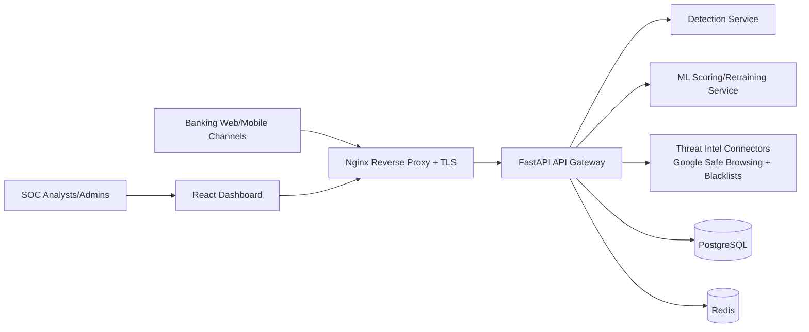

# Architecture Diagram

```mermaid
flowchart LR
    C[Banking Web/Mobile Channels] --> N[Nginx Reverse Proxy + TLS]
    N --> A[FastAPI API Gateway]
    A --> D[Detection Service]
    A --> M[ML Scoring/Retraining Service]
    A --> T[Threat Intel Connectors\nGoogle Safe Browsing + Blacklists]
    A --> P[(PostgreSQL)]
    A --> R[(Redis)]
    S[SOC Analysts/Admins] --> U[React Dashboard]
    U --> N
```
